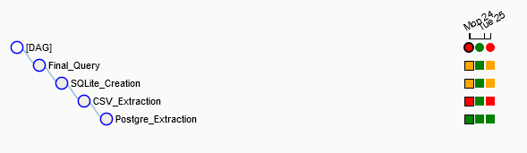

# Simple Airflow pipeline for data extraction

## About

Our goal is to extract data from two sources: a PostgreSQL database (that will be running on a Docker container), and a local .csv file. After extraction into local data, we will combine the data into a new database of our choosing, and perform a query to obtain all the data of an order from the order and order_detail tables.


This process will also need to fill these requirements:
- Tasks should be idempotent (they should not affect future runs of tasks)
- Pipeline needs to run sequentially
- If the pipeline fails, it should be clear where the failure occured
- Our local files need to be structured inside the **data** folder, with a subfolder for each table, that contains another subfolder for each date the pipeline ran
- A .csv file needs to be available at the end of the pipeline
- The pipeline should be ready to run for several days. This includes having the possibility of reprocessing data for past days.

## Database used

We are using a modified version of Microsoft's Northwind Dataset.
The original database included an additional table called **order_details** that has been detached from our data and is instead in the external .csv file.

Schema of the original Northwind Database: 


## Project decisions

For the basic tasks, we are using 4 simple python scripts:
- ***psql_extract.py*** - Extracts data from our running database into the **data** folder, creating a **postgres** subfolder in the process, if it doesn't exist yet, and the subfolder scheme outlined in our About section. Files created will be named as ***table_name.csv***.
- ***csv_extract.py*** - Extracts data from our local .csv file. In reality all it will do is copy the file into the proper subfolder inside the **data** folder, with proper date stamping.
- ***sqlite_load.py*** - Loads our local files into a SQLite database.
- ***sqlite_query.py*** - Executes the final SELECT query required.

These scripts will be loaded by using [Apache Airflow](https://airflow.apache.org/). Airflow will allow us to fulfill most of our project requirements, as it will allow an easy way to both run our pipeline daily, with the option of re-running it for past days, and also to easily tell in which point the pipeline might fail. No local installation will be required, as we will be running Airflow using a [docker container](https://www.docker.com/).


## Setup

We only require [Docker Engine and Docker Compose](https://docs.docker.com/compose/install/) installed

With both installed simply run

```
docker-compose up
```
Our Airflow task will be scheduled to automatically run daily. After running the command, visit your [localhost](https://localhost:8080) on port 8080 (assuming you didn't change the docker-compose.yml file), find the *pipeline* DAG, and turn it on.

In case you wish to see it run right away after setting up the docker containers, simply choose to Trigger DAG on the DAG list on the Airflow UI on your localhost.

### Some notes:
Check ***docker-compose.yml*** for ports. The standard ports used for Airflow (8080) and PostgreSQL (5342) are mapped to the same value on our local machine. You might want to change these values depending on your current available ports.

On the scripts folder, the file ***csv_extract_test.py*** removes the lines for Python's Try-Except functionality, which will cause the pipeline to fail if ran twice on the same day (as the error will be caught by Airflow instead). This is included for showcasing an example of pipeline failure, that can be visualized on the Airflow DAG UI on your localhost:

 

 Simply replace the original ***csv_extract.py*** with the test file if you wish to visualize a pipeline failure example.

